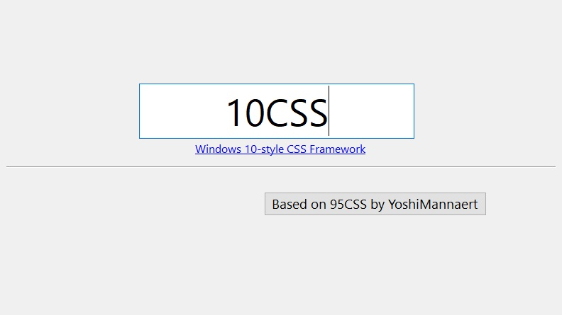

# 10CSS
## A Windows 10 style CSS framework, based on [95CSS](https://github.com/YoshiMannaert/95CSS)

<!--  -->

### Browser compatibility

## About
10CSS is a simple CSS framework in the style of the Windows10  
We tried to make it as similar to Windows 10 MFC/WinForms as possible  
dont blame me for writing shitty css pls

## Getting started
Get [10css](css/10css.min.css)

## Styled components
At this moment, the following components have been styled

### Buttons
Including
- Default state
- Active state
- Focused state
- Disabled state
- Highlighted state (Think of this as a "primary" button)

### Inputs
- Text inputs
- Number inputs
- Checkboxes
- Radios
- Selects
  - Including [multiple]
- Range
- Color

### Dialogs
Comes in different sizes
Can be used for modals/popups as well as a card component

### Other components
- Tabs
- Fieldsets (GroupBoxes)
- Legends
- Dividers (`hr`'s)
- Progress bars
- Scrollbars
- Header/navigation

### Helpers
We currently provide basic helpers for the following styling:
- Width
- Spacing (margins, paddings, gaps)
- Grid
This will be expanded upon in the future

## Javascript
Currently, no JavaScript is included in the framework. While this may change in the future to enhance interactivity for certain components—such as tabs, modals, or dropdowns—or to enable more advanced styling, our focus is on providing robust CSS styles that make it easy for you to implement any necessary JavaScript yourself.

## Copyright and license
Code copyright 2025 Yoshi Mannaert. Code released under the MIT license.